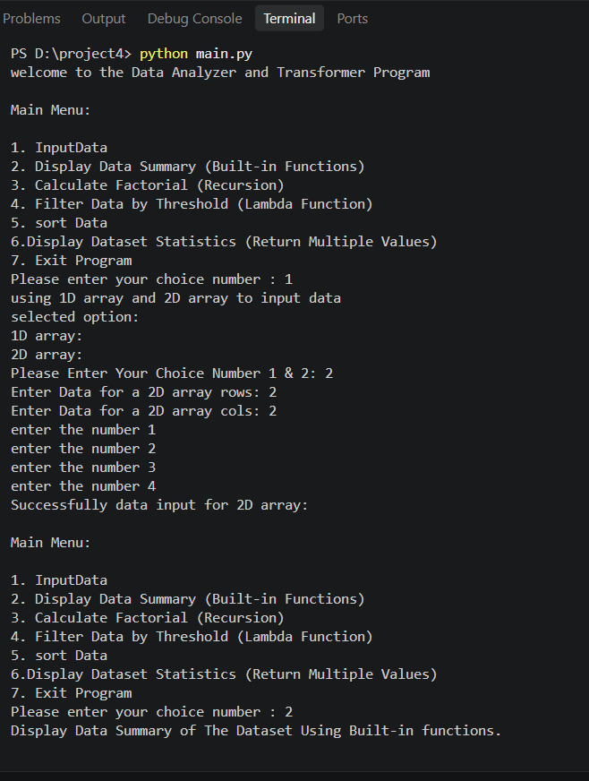

# 📊 Data Analyzer and Transformer Program

## 📌 Project Description

The **Data Analyzer and Transformer Program** is a Python-based menu-driven application designed to input, analyze, filter, sort, and calculate statistics from datasets.

This project demonstrates several important Python programming concepts, including:

- 1D and 2D Arrays (Lists)
- Built-in Functions
- Recursion
- Lambda Functions
- Sorting
- Functions Returning Multiple Values
- Menu-Driven Programming
- Loops and Conditional Statements

---
# 📂 Project Structure

```text
Data-Analyzer-and-Transformer/
│
├── main.py
├── output.png
└── README.md


## 📸 Program Output



## 🚀 Features

The program provides the following options:

1. **Input Data**
2. **Display Data Summary**
3. **Calculate Factorial**
4. **Filter Data by Threshold**
5. **Sort Data**
6. **Display Dataset Statistics**
7. **Exit Program**

---

Use this Markdown directly in your README.md:

# 🛠️ Technologies Used

| Technology | Purpose |
|---|---|
| **Python 3** | Programming Language |
| **Lists** | 1D and 2D Data Storage |
| **Built-in Functions** | Data Analysis |
| **Recursion** | Factorial Calculation |
| **Lambda Function** | Data Filtering |
| **`sorted()`** | Data Sorting |
| **Functions** | Program Organization |
| **Loops** | Menu Control |
| **Conditional Statements** | User Choice Handling |

## 📋 Main Menu

```text
Main Menu:

1. InputData
2. Display Data Summary (Built-in Functions)
3. Calculate Factorial (Recursion)
4. Filter Data by Threshold (Lambda Function)
5. Sort Data
6. Display Dataset Statistics (Return Multiple Values)
7. Exit Program

Please enter your choice number:
